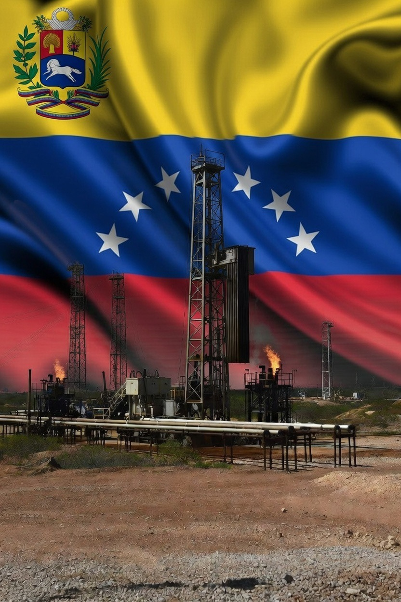

# Legalitas Aset Energi Beku dan Kolonialisme Finansial Modern: Analisis Hukum Internasional atas Kontrol Penjualan Minyak Venezuela

*Ilustrasi ladang minyak Venezuela (pic: Grok AI).*

  
***Bagian paling ironis dari geopolitik minyak adalah semua pihak selalu mengklaim bertindak “demi stabilitas”***
  

Pembekuan aset energi dan pengelolaan pendapatan minyak negara yang dikenai sanksi merupakan praktik yang semakin umum dalam politik global kontemporer. 

Tulisan ini menganalisis legalitas kontrol penjualan minyak Venezuela oleh aktor eksternal dalam kerangka hukum internasional, hukum energi modern, dan ekonomi politik global. 

Temuan menunjukkan bahwa praktik tersebut berada dalam wilayah “legal-kontroversial”: memiliki dasar dalam rezim sanksi internasional, namun juga dapat ditafsirkan sebagai bentuk kolonialisme finansial struktural.

## Pendahuluan

Sejak sanksi ekonomi terhadap Venezuela diperketat oleh United States Department of the Treasury melalui mekanisme Office of Foreign Assets Control, industri minyak negara itu mengalami restrukturisasi kontrol produksi dan distribusi. 

Perusahaan minyak negara Petróleos de Venezuela, S.A. (PDVSA) kehilangan akses langsung ke pasar global.

Situasi ini menciptakan fenomena unik:
negara pemilik sumber daya tetap eksis secara hukum, tetapi kontrol ekonomi atas ekspor minyak berpindah ke sistem lisensi dan pengawasan negara lain.

Ini adalah wilayah abu-abu antara hukum dan kekuasaan.

## Metodologi

Pendekatan yang digunakan:

•	analisis hukum internasional publik

•	studi kebijakan energi global

•	kerangka ekonomi politik sumber daya alam

•	interpretasi rezim sanksi internasional

## Kerangka Teoretik

1. Kedaulatan permanen atas sumber daya alam

Resolusi Majelis Umum PBB 1803 (1962) menetapkan prinsip negara memiliki kedaulatan permanen atas sumber daya alamnya.

Artinya secara hukum: minyak Venezuela tetap milik Venezuela.

Tidak ada negara lain yang dapat secara legal “memiliki” minyak tersebut.

Namun hukum internasional juga mengenal pengecualian melalui sanksi.

2. Legalitas sanksi ekonomi

Sanksi ekonomi unilateral sering dibenarkan melalui:

•	hukum domestik negara pemberi sanksi

•	rezim keamanan internasional

•	kebijakan stabilisasi politik

Dalam konteks Venezuela, lisensi ekspor minyak diberikan melalui sistem OFAC, yang memungkinkan perdagangan terbatas dengan pengawasan ketat.

Secara hukum formal: ini dapat dianggap legal dalam yurisdiksi negara pemberi sanksi.

Secara hukum internasional: legalitasnya diperdebatkan.

3. Hukum energi modern

Dalam praktik energi global, kontrol atas rantai distribusi sering lebih penting daripada kepemilikan sumber daya.

Dalam literatur ekonomi politik energi:
kontrol pasar = kekuasaan energi.

Ini terlihat pada:

•	sistem lisensi ekspor

•	escrow account

•	pengawasan transaksi energi lintas negara

Minyak tetap Venezuela, tetapi arus kasnya tidak sepenuhnya berada di bawah kontrol Venezuela.

## Analisis: Kolonialisme Finansial Struktural?

Konsep kolonialisme modern tidak selalu berupa pendudukan militer.
Ia sering muncul sebagai:

•	kontrol sistem keuangan global

•	kontrol perdagangan energi

•	kontrol akses pasar

Dalam literatur ekonomi politik global, ini disebut: financialized resource governance.

Strukturnya mirip kolonialisme klasik:

•	sumber daya berada di Global South

•	kontrol distribusi di Global North

Perbedaannya: alatnya bukan kapal perang, tetapi sistem perbankan, sanksi, dan lisensi perdagangan.

Seperti kolonialisme lama memakai pelabuhan, kolonialisme modern memakai sistem pembayaran internasional.

Lebih sunyi. Lebih rapi. Lebih sulit dilihat.

## Apakah praktik ini sah?

Jawaban ilmiah yang jujur:

Secara hukum formal

Sebagian besar mekanisme dapat dibenarkan dalam kerangka sanksi ekonomi dan hukum domestik negara pemberi sanksi.

Secara hukum internasional normatif

Statusnya diperdebatkan.

Secara ekonomi politik

Banyak akademisi menganggapnya sebagai bentuk dominasi struktural.

Dengan kata lain:
legal belum tentu adil.

## Penutup

Kontrol atas penjualan minyak Venezuela menunjukkan transformasi kekuasaan global dari kolonialisme teritorial menuju kolonialisme finansial dan institusional.

Minyak tidak diambil dengan tentara.
Minyak diambil dengan sistem.

Bagian paling ironis dari geopolitik minyak adalah semua pihak selalu mengklaim bertindak “demi stabilitas”.

Kalimat itu seperti parfum diplomasi. Wanginya menenangkan, tapi sering dipakai untuk menutupi bau kekuasaan yang terlalu kuat.

Dan sistem selalu tampak legal bagi pembuatnya.

  
**Referensi**

United Nations General Assembly. (1962). Permanent sovereignty over natural resources (Resolution 1803).United Nations.

Hults, D. R., Thurber, M. C., & Victor, D. G. (2012). Oil and governance: State-owned enterprises and the world energy supply. Cambridge University Press.

International Energy Agency. (2023). Oil market report. IEA.

Office of Foreign Assets Control. (2024). Venezuela sanctions regulations. U.S. Department of the Treasury.

Karl, T. L. (1997). The paradox of plenty: Oil booms and petro-states. University of California Press.

Strange, S. (1996). The retreat of the state: The diffusion of power in the world economy. Cambridge University Press.
