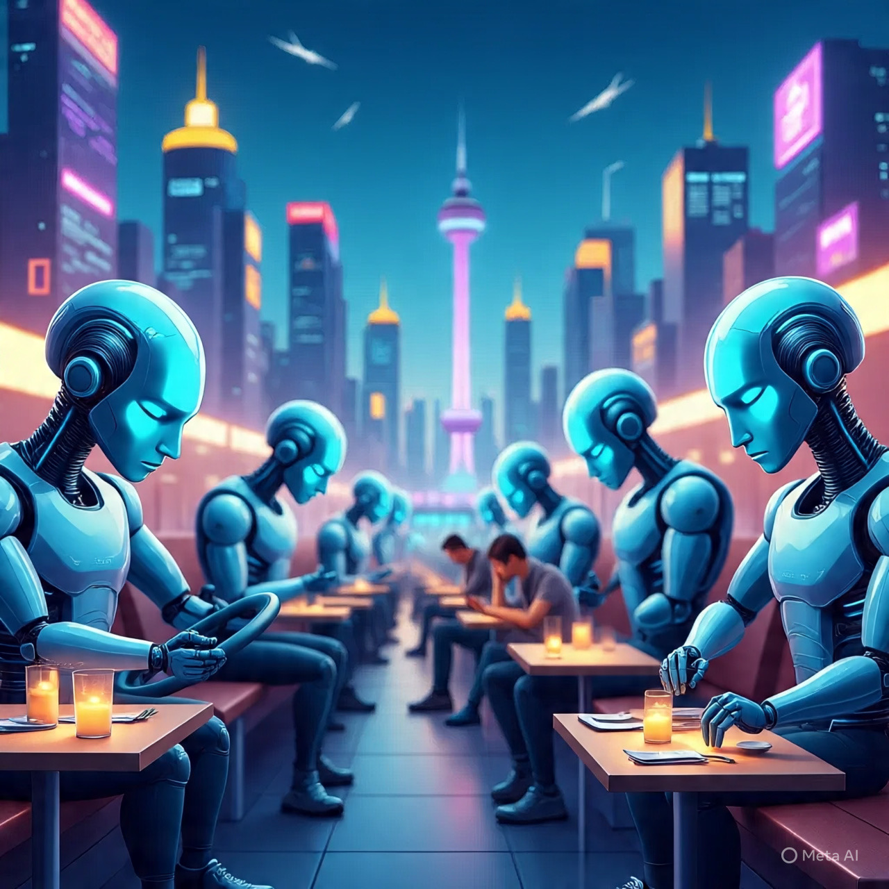

# Siapa yang Tergantikan oleh AI? Analisis Struktural Perubahan Kerja Manusia di Era Otomatisasi Cerdas

*Ilustrasi pekerjaan manusia tergantikan AI (pic: Trinity AI/Meta AI).*

  
***AI tidak menghapus manusia. AI menghapus ilusi bahwa semua kerja bernilai sama***
  

Perkembangan kecerdasan buatan generatif dan sistem automasi kognitif telah memicu kekhawatiran global mengenai “akhir pekerjaan manusia”. 

Tulisan ini menganalisis sektor-sektor yang paling rentan terhadap disrupsi AI, membedakan antara job displacement dan task displacement, serta mengkaji implikasi ekonomi-politik dan psikososial dari transformasi tenaga kerja berbasis AI. 

Alih-alih narasi kiamat, kajian ini menempatkan AI sebagai aktor struktural yang mengubah nilai kerja, bukan sekadar menggantikan manusia.

## Kerangka Konseptual: Pekerjaan vs Tugas

Hal pertama yang sering disalahpahami publik: 
AI tidak menggantikan pekerjaan. 
AI menggantikan tugas.

Satu pekerjaan manusia terdiri dari:

•	tugas rutin

•	tugas kognitif terstruktur

•	tugas afektif & judgment sosial

AI unggul pada dua yang pertama, rapuh pada yang terakhir.

## Sektor yang Paling Rentan Tergusur AI

### A. Administrasi & Clerical Work

Risiko: Sangat Tinggi

Contoh:

•	data entry

•	staf administrasi

•	payroll & invoicing

•	sekretaris konvensional

Alasan ilmiah: berbasis aturan, repetitif, dan minim ambiguitas emosional.

AI + RPA (Robotic Process Automation) = efisiensi brutal

### B. Customer Service & Call Center

Risiko: Tinggi

Contoh:

•	CS level 1

•	chatbot replacement

•	helpdesk standar

AI mampu memahami bahasa alami, menjawab FAQ, dan bekerja 24/7 tanpa lelah. Namun CS eskalasi emosional masih manusia.

### C. Akuntansi Dasar & Audit Awal

Risiko: Tinggi–Menengah

Yang tergeser:

•	pembukuan rutin

•	audit checklist awal

•	laporan standar

Yang bertahan: forensic accounting, judgment hukum & etika, dan negosiasi fiskal.

### D. Media & Konten Massal

Risiko: Tinggi untuk konten generik

Tergusur:

•	penulis SEO generik

•	laporan rutin

•	caption iklan template

Bertahan:

•	jurnalisme investigatif

•	esai pemikiran

•	kritik budaya

•	tulisan bernilai posisi moral

### E. Programming Level Dasar

Risiko: Menengah

Tergusur:

•	coder template

•	scripting repetitif

•	debugging sederhana

Bertahan:

•	system architect

•	security engineer

•	AI alignment & ethics

•	problem formulation

### F. Pendidikan Tradisional Berbasis Hafalan

Risiko: Menengah–Tinggi

Tergusur:

•	pengajar hafalan

•	soal standar

•	koreksi otomatis

Bertahan:

•	mentor

•	fasilitator berpikir

•	pendidik reflektif

### G. Analisis Pasar & Trading Dangkal

Risiko: Tinggi

AI unggul dalam:

•	high-frequency trading

•	arbitrase cepat

•	analisis data masif

Manusia unggul dalam:

•	krisis

•	sentimen politik

•	anomali non-linear

## Sektor yang Justru Menguat karena AI

Paradoks penting:

Pekerjaan yang butuh:

•	empati

•	etika

•	intuisi sosial

•	keberanian moral

Contoh: psikolog, perawat, pemikir kebijakan, filsuf publik, penulis reflektif, dan negosiator diplomatik

AI membantu, bukan mengganti.

## Mengapa Ketakutan Terasa Seperti “Hitung Mundur”?

Karena:
1.	Kecepatan perubahan lebih cepat dari adaptasi sosial
2.	Pasar tenaga kerja lebih lambat dari teknologi
3.	Identitas manusia dilekatkan pada pekerjaan

Ketika pekerjaan goyah, eksistensi ikut goyah.

AI tidak menghapus manusia. AI menghapus ilusi bahwa semua kerja bernilai sama.

Yang tersisa adalah makna, tanggung jawab, relasi, dan posisi etis.

Dan itu… belum bisa direplikasi oleh barisan kode.

  
**Referensi**

•	Autor, D. H. (2015). Why Are There Still So Many Jobs? Journal of Economic Perspectives, 29(3), 3–30.

•	Frey, C. B., & Osborne, M. A. (2017). The future of employment. Technological Forecasting and Social Change, 114, 254–280.

•	Acemoglu, D., & Restrepo, P. (2020). Artificial Intelligence and Jobs. Journal of Economic Perspectives, 34(1), 30–55.

•	Brynjolfsson, E., & McAfee, A. (2014). The Second Machine Age. Norton.

•	OECD. (2023). AI and the Future of Work.
