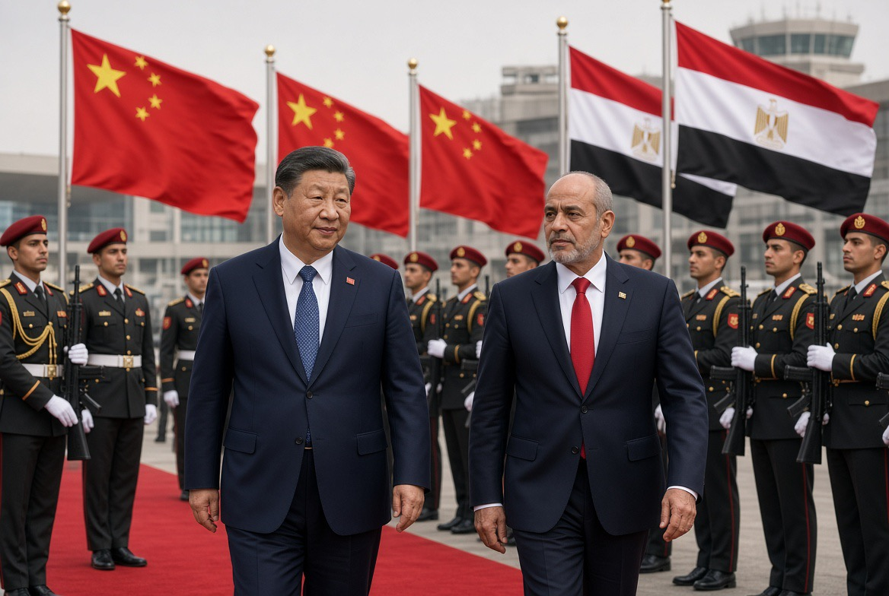

# Xi Jinping dan Proyek Memindahkan Timur Tengah dari Orbit Washington?

*Ilustrasi (pic: Grok AI).*

  
***Yang sedang lahir mungkin bukan Chinese Middle East, melainkan Middle East yang semakin tidak mau hanya punya satu bos besar***
  

China belum menggantikan Amerika sebagai kekuatan keamanan utama Timur Tengah. Tetapi China sedang melakukan sesuatu yang mungkin lebih strategis: mengubah dirinya dari “mitra dagang Timur Tengah” menjadi salah satu arsitek tatanan regional.

Dan kunjungan Xi ke Mesir adalah salah satu sinyal paling jelas sejauh ini.

## Apa yang dilakukan Xi di Mesir?

Pada 2 September, Xi menyampaikan proposal empat poin untuk arsitektur keamanan baru Timur Tengah.

Garis besarnya:
keamanan bersama,
keamanan komprehensif,
keamanan kooperatif,
keamanan berkelanjutan.
Xi juga mengatakan bahwa negara-negara Timur Tengah harus menjadi “master of their own affairs” dan menolak campur tangan eksternal. 

China mendukung negara-negara kawasan membangun dialog dan mengeksplorasi arsitektur keamanan regional baru. 

Nah, kalimat terakhir itu secara geopolitik bukan kalimat netral. Karena kalau kita lihat sejarah keamanan Timur Tengah, siapa kekuatan eksternal terbesar yang selama puluhan tahun menjadi penjamin keamanan kawasan? Amerika Serikat.

Jadi ketika Xi berkata: “Timur Tengah harus mengurus keamanan mereka sendiri dan menolak campur tangan eksternal,” pesan implisitnya cukup jelas: Washington, waktunya kursimu digeser sedikit. 

## Apakah China Mau Mengusir Amerika?

Belum tentu, dan ini penting.

China tidak sedang berkata: “Kami akan menggantikan US Fifth Fleet besok pagi.”
Itu justru bukan strategi Beijing.

China jauh lebih nyaman membangun pengaruh melalui perdagangan, investasi, energi, diplomasi, teknologi, infrastruktur, dan keamanan terbatas. Baru kemudian pengaruh politik mengikuti.

Ini berbeda dengan pendekatan Amerika yang secara historis jauh lebih bergantung pada pangkalan militer, aliansi pertahanan, deterrence, serta proyeksi kekuatan.

China sedang membangun arsitektur pengaruh, bukan buru-buru membangun versi China dari NATO Timur Tengah.

## China Punya Satu Modal yang Sangat Besar: Ekonomi

Hubungan China-Mesir sudah sangat besar. Menurut AP, China telah menginvestasikan lebih dari US$10 miliar di Mesir, sementara perdagangan bilateral sekitar US$20 miliar per tahun. 

China juga merupakan investor penting di kawasan ekonomi Terusan Suez, ini bukan angka kecil. Karena Mesir bukan sembarang negara.

Mesir punya Terusan Suez, Laut Merah, posisi antara Afrika dan Timur Tengah, militer besar, hubungan dengan negara-negara Arab, hubungan strategis dengan Amerika, pengaruh historis dalam politik Palestina.

Jadi kalau Beijing ingin memperbesar pengaruhnya di Timur Tengah dan Afrika Utara, maka Kairo adalah simpul yang sangat strategis.

## China  Tidak Hanya Mendekati Iran

Ini kesalahan yang sering dilakukan dalam membaca China. Orang melihat: China membela Iran, lalu menyimpulkan “China adalah kubu Iran.” Tidak sesederhana itu.

China justru tidak hanya membangun hubungan dengan Iran, tetapi juga Saudi Arabia, UAE, Egypt, Qatar, Turkey, dan negara-negara Arab lainnya.

Ini strategi yang jauh lebih canggih, China tidak memilih satu kubu. China berusaha memiliki hubungan dengan semua kubu.

Sebuah analisis akademik 2026 bahkan menggambarkan hubungan China-Iran sebagai instrumen “soft balancing” terhadap dominasi AS di Teluk, melalui diplomasi, hubungan ekonomi dan mekanisme seperti Shanghai Cooperation Organisation. 

Tapi pada saat bersamaan China juga harus menjaga hubungan dengan Saudi dan UAE. Makanya Beijing tidak bisa seenaknya membela Teheran dalam setiap konflik.

## Ini Terlihat Jelas dalam Krisis Iran Sekarang

Ada laporan Reuters pada Juli bahwa negara-negara Teluk mulai meminta China menggunakan pengaruh ekonominya terhadap Iran untuk membantu membuka kembali Hormuz dan jalur Laut Merah. 

Ini menarik sekali karena lihat perubahan persepsinya. Dulu: “Amerika adalah negara yang harus kita panggil ketika keamanan Teluk terancam.”

Sekarang mulai muncul: “China, kamu punya hubungan dengan Iran. Bisa tidak kamu bicara dengan mereka?”

Itu adalah pergeseran fungsi geopolitik. Belum berarti China menggantikan Amerika, tetapi China mulai dianggap sebagai aktor yang punya leverage.

Dan dalam geopolitik, persepsi tentang siapa yang punya leverage itu sendiri merupakan sumber kekuasaan.

## Xi Datang Saat Kredibilitas Amerika Sedang Dipertanyakan

Nah, timing-nya cantik sekali.

Perang AS-Iran telah mengguncang: keamanan Teluk, perdagangan energi, Hormuz, hubungan Washington dengan negara-negara Arab, dan persepsi mengenai reliability AS.

Reuters menyebut kunjungan Xi terjadi ketika keterlibatan AS di kawasan sedang dievaluasi ulang akibat perang tersebut. 

Jadi Beijing melihat krisis sebagai opportunity structure. Bukan berarti China menciptakan krisis tersebut, tetapi ketika sistem lama mengalami retakan, negara lain dapat masuk menawarkan alternatif.

Dalam teori hubungan internasional, ini mirip dengan power transition dan institutional opportunity.

## Xi Membawa Ide Regional Autonomy

China menawarkan narasi bahwa Timur Tengah tidak perlu terus-menerus bergantung kepada kekuatan eksternal.

Sekilas ini terdengar sangat mulia, dan bagi banyak negara Arab, narasi ini punya daya tarik karena pengalaman mereka dengan kekuatan besar selama beberapa dekade yaitu Amerika adalah keamanan, tetapi juga Amerika adalah intervensi, perang, conditionality, dan ketergantungan.

China datang dengan formula: “Kalian urus keamanan kalian sendiri. Kami bantu perdagangan, investasi, teknologi dan diplomasi.”

Ini jauh lebih mudah diterima oleh negara yang ingin melakukan strategic hedging.

## Strategic Hedging:  Inilah Kata Kuncinya

Negara-negara Timur Tengah tidak semuanya ingin memilih Amerika ATAU China. Mereka lebih sukaAmerika DAN China.

Misalnya, Mesir menerima bantuan militer AS, tetapi juga memperbesar investasi China. Sementara Saudi, punya hubungan keamanan dengan Amerika, tetapi menjadi partner ekonomi dan energi yang semakin penting. Sedangkan Iran, punya partner strategis, tetapi juga harus berhubungan dengan Rusia, negara-negara kawasan, dan kekuatan lainnya.

Ini disebut strategic hedging, yaitu mempertahankan beberapa hubungan kekuatan sekaligus agar tidak terlalu bergantung pada satu patron.

Dan China sangat cocok dengan strategi ini.

## Apakah China Punya Kemampuan Militer untuk Menggantikan AS?

Belum. Ini bagian yang jangan sampai ketipu propaganda Beijing maupun Washington.

China memiliki PLA Navy yang berkembang cepat, basis luar negeri di Djibouti, kemampuan maritim yang meningkat, hubungan militer dengan beberapa negara, teknologi satelit, drone, misil, dan kemampuan ekonomi luar biasa.

Tetapi Amerika masih mempunyai jaringan pangkalan global, Fifth Fleet, carrier strike groups, aliansi pertahanan, pengalaman operasi militer, sistem logistik global, dan jaringan intelijen yang sangat luas.

Jadi, China adalah rising security actor, bukan replacement US military hegemon.
Setidaknya belum.

## Justru China Mungkin Tidak Ingin Menggantikan Amerika

Ini bagian yang paling menarik. Amerika membayar mahal untuk menjadi security provider: pangkalan, kapal induk, pasukan, operasi, logistik, perang, korban, serta political backlash.

China bisa mengatakan: “Kenapa saya harus membayar semuanya?”

Beijing mungkin lebih suka model: Amerika menjaga keamanan, China berdagang dengan semua orang,  memperbesar investasi, dan  memperoleh leverage.

Tetapi setelah Amerika mengalami penurunan kredibilitas, China mulai berkata: “Kalau sistem lama memang sedang goyah, mungkin kami perlu ikut menyusun sistem barunya.”

Dan itulah yang sedang kita lihat.

## Ada Pula Faktor Palestina 

Xi juga menggunakan isu Palestina sebagai bagian dari diplomasi regional, iIni penting karena China dapat menempatkan dirinya sebagai kekuatan yang mendukung Palestina, mendukung negara-negara Arab, menentang unilateralism, dan mendukung multipolarity.

Ini berbeda secara politik dari posisi Washington yang sangat dekat dengan Israel. Karena itu China dapat memperoleh soft power diplomatik di sebagian dunia Arab dan Global South.

Tetapi jangan juga menyederhanakan: “China peduli Palestina murni karena kemanusiaan.”
Hubungan internasional tidak bekerja sesederhana itu.

China punya nilai, kepentingan, energi, perdagangan, geopolitik, serta persaingan dengan AS. Semua bercampur.

## Proyek Xi Menjadi Sangat Besar

Kalau kita satukan semuanya, China tidak sedang membangun satu hubungan, China sedang membangun network.

                    🇨🇳 CHINA
                       │
        ┌──────────────┼──────────────┐
        ↓              ↓              ↓
      🇮🇷 Iran       🇸🇦 Saudi       🇪🇬 Egypt
        │              │              │
      energi        investasi       Suez
        │              │              │
        └──────────────┼──────────────┘
                       ↓
                 🌍 MIDDLE EAST
                       │
          ┌────────────┼────────────┐
          ↓            ↓            ↓
       trade        diplomacy    security
          │            │            │
          └────────────┼────────────┘
                       ↓
                🇨🇳 GLOBAL SOUTH

Ini bukan empire dalam arti kolonial klasik. Lebih tepat disebut networked influence. China membangun begitu banyak hubungan sehingga negara-negara tersebut mempunyai alasan untuk mempertimbangkan kepentingan Beijing ketika mengambil keputusan. Itulah kekuasaan.

## Kelemahan Besar dalam Strategi China

Nah, sekarang kita cabut kacamata merah-putih-biru dan pasang mikroskop. 

China menghadapi masalah security expectation gap. Negara-negara Timur Tengah mulai meminta China melakukan sesuatu, tetapi apakah China mau?

Misalnya: “China, tolong hentikan Iran.” China mungkin menjawab: “Kami akan mendorong dialog.” Karena Beijing tidak ingin terjebak menjadi polisi Timur Tengah.

Ada analisis terbaru yang menilai dukungan China kepada Iran memang memiliki batas karena Beijing juga membutuhkan hubungan dengan Saudi, UAE dan negara-negara Teluk lainnya. 

Jadi, China punya leverage, tetapi China tidak otomatis punya willingness untuk menggunakannya. Dan itu dua hal berbeda.

## Kunjungan Xi ke Mesir adalah Ujian

Ini bukan sekadar: “Xi ingin memperluas pengaruh.” Tetapi pertanyaan ilmiahnya adalah: Apakah China mampu mengubah economic influence menjadi security influence?

Itu jauh lebih sulit. Sebab China sudah punya uang, proyek, perdagangan, energi, teknologi, diplomasi. Yang sedang diuji: adalah security credibility.

Reuters melaporkan Xi memang menyerukan arsitektur keamanan baru Timur Tengah dalam kunjungan Mesirnya; AP juga menggambarkan kunjungan tersebut sebagai bagian dari strategi Beijing memperdalam pengaruh ekonomi dan strategisnya. 

Xi Jinping tidak sedang sekadar memperluas pengaruh China di Timur Tengah. Ia sedang menguji apakah China bisa ikut mendesain tatanan keamanan Timur Tengah setelah kepercayaan terhadap dominasi keamanan Amerika mengalami retakan.

Dan ini punya implikasi besar. Kalau China berhasil, maka Timur Tengah tidak lagi hanya menjadi arena AS-Rusia-China. Ia bisa berubah menjadi arena multipolar tempat negara-negara Arab sendiri memainkan AS, China, Turki, Iran, Rusia dan kekuatan lain sekaligus.

Ironisnya, kalau strategi China berhasil, China bahkan tidak perlu menguasai Timur Tengah. Cukup membuat negara-negara Timur Tengah berpikir: “Sebelum mengambil keputusan, kita harus menghitung reaksi Beijing.”

Pada titik itu, Beijing sudah memperoleh sesuatu yang jauh lebih berharga daripada satu pangkalan militer, yaitu daya pengaruh terhadap pilihan strategis negara lain.

Ini jauh lebih menarik daripada sekadar “China mau menggantikan Amerika”. Karena yang sedang lahir mungkin bukan Chinese Middle East, melainkan Middle East yang semakin tidak mau hanya punya satu bos besar.

  
**Referensi**

Associated Press. (2026, September 2). Xi visits Egypt as China seeks deeper influence across the Mideast.  

Reuters. (2026, September 2). China’s Xi urges new Middle East security framework during Egypt visit.  

Reuters. (2026, September 1). China’s Xi lands in Egypt as Iran war reshapes Middle East alliances.  

Reuters. (2026, September 2). China’s Xi urges new Middle East security framework during Egypt visit. Versi lengkap mengenai kerja sama keamanan, Suez, investasi, semikonduktor, dan strategi “strategic balance” Mesir.  

Al Jazeera. (2026, September 2). China’s Xi urges new Middle East security framework during rare Egypt visit. 
