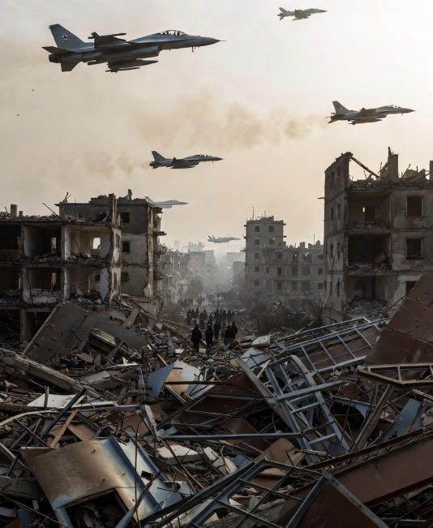

# Orde Dunia Modern sebagai Paradoks Moral: Kekuasaan, Pasar, dan Dekonstruksi Kedaulatan Internasional
<figure>
  
  <figcaption><strong>Gambar.</strong> Ilustrasi kedaulatan tidak universal</figcaption>
</figure>

  
***Kasus Palestina, Ukraina, Yaman, dan Taiwan menunjukkan bahwa kedaulatan tidak bersifat universal, melainkan bersyarat pada posisi geopolitik negara tersebut***

  

Orde dunia pasca-Perang Dingin sering dipromosikan sebagai sistem internasional berbasis aturan, hak asasi manusia, dan kedaulatan negara. 

Namun, praktik aktual menunjukkan kontradiksi sistemik antara norma yang diklaim dan realitas operasional kekuasaan global. 

Artikel ini menganalisis bagaimana kepentingan politik, ekonomi, dan industri keamanan telah mengikis prinsip kedaulatan internasional, mentransformasikan konflik regional menjadi komoditas geopolitik, serta memproduksi standar moral selektif. 

Dengan pendekatan ekonomi politik kritis dan realisme struktural, artikel ini menunjukkan bahwa ketidakstabilan global bukan anomali, melainkan fitur fungsional dari orde dunia kontemporer.

## Pendahuluan

Retorika global hari ini dipenuhi istilah mulia: rules-based order, demokrasi, HAM, dan stabilitas internasional. 

Namun, fakta empiris memperlihatkan bahwa pelanggaran kedaulatan, intervensi militer sepihak, serta normalisasi konflik bersenjata justru meningkat.

Pertanyaan kuncinya bukan lagi apakah sistem ini gagal, melainkan:
siapa yang diuntungkan dari kegagalannya?

Di sinilah kritik terhadap orde dunia menjadi tak terelakkan.

## Kerangka Teoretis

1. Realisme Struktural

Negara bertindak bukan berdasarkan moral, tetapi kepentingan kekuasaan dan keamanan (Waltz, 1979). Norma internasional tunduk pada distribusi kekuatan.

2. Ekonomi Politik Internasional Kritis

Konflik bukan sekadar tragedi, melainkan bagian dari sirkulasi kapital, khususnya dalam industri pertahanan dan energi (Strange, 1996).

3. Hegemoni Moral

Gramsci menjelaskan bagaimana nilai “universal” sering kali adalah kepentingan partikular yang dinaturalisasi (Gramsci, 1971).

## Orde Dunia sebagai Sistem Selektif

1. Kedaulatan sebagai Konsep Elastis
• Invasi disebut “pelanggaran” jika dilakukan musuh.
• Disebut “intervensi kemanusiaan” jika dilakukan sekutu.

Kasus Palestina, Ukraina, Yaman, dan Taiwan menunjukkan bahwa kedaulatan tidak bersifat universal, melainkan bersyarat pada posisi geopolitik negara tersebut.

2. Konflik sebagai Komoditas

Industri senjata global mencetak rekor penjualan justru saat konflik meningkat.
• AS sebagai eksportir senjata terbesar dunia.
• Konflik regional meningkatkan permintaan, legitimasi anggaran militer, dan pengaruh strategis.

Perang tidak hanya dikelola secara militer, tetapi dipelihara secara ekonomi.

3. Kekacauan yang “Berguna”

Ketidakstabilan di Timur Tengah, Laut China Selatan, dan Eropa Timur:
• Mengalihkan perhatian publik global.
• Melemahkan solidaritas lintas isu.
• Memberi ruang bagi ekspansi teritorial dan kontrol sumber daya.

Dalam konteks ini, penderitaan sipil menjadi externality yang diterima sistem.

## Standar Moral Ganda dan Represi Wacana: Cancel Culture sebagai Instrumen Politik Lunak

Kritik terhadap tatanan global sering:
• Diredam bukan dengan debat, tapi delegitimasi moral.
• Dilabeli ekstrem, intoleran, atau berbahaya.

Ini bukan kebebasan berekspresi, melainkan disiplin wacana.

Seperti dikatakan: Demokrasi sejati bukan keseragaman pandangan, melainkan keberanian berbeda tanpa dilenyapkan.

## Implikasi Global

1. Normalisasi Kekerasan Struktural
Perang menjadi latar permanen kehidupan global.

2. Erosi Hukum Internasional
Hukum berubah menjadi alat, bukan batas.

3. Depolitisasi Publik
Masyarakat lelah, bingung, dan akhirnya apatis.

Orde dunia saat ini bukan sistem yang gagal menjaga perdamaian, melainkan sistem yang berfungsi melalui ketidakstabilan. 

Kedaulatan internasional telah direduksi menjadi retorika, sementara kekuasaan riil bergerak melalui pasar senjata, aliansi strategis, dan kontrol narasi.

Mengkritik sistem ini bukan radikalisme, melainkan tindakan intelektual yang diperlukan.

Dan ya… argumen ini tidak bisa dibatalkan hanya dengan label emosi atau stigma moral.

  

**Referensi**

Acharya, A. (2018). The end of American world order. Polity Press.

Chomsky, N. (2016). Who rules the world? Metropolitan Books.

Gramsci, A. (1971). Selections from the prison notebooks. International Publishers.

Mearsheimer, J. J. (2018). The great delusion: Liberal dreams and international realities. Yale University Press.

Strange, S. (1996). The retreat of the state: The diffusion of power in the world economy. Cambridge University Press.

Waltz, K. N. (1979). Theory of international politics. McGraw-Hill.

SIPRI. (2024). Trends in international arms transfers. Stockholm International Peace Research Institute.
