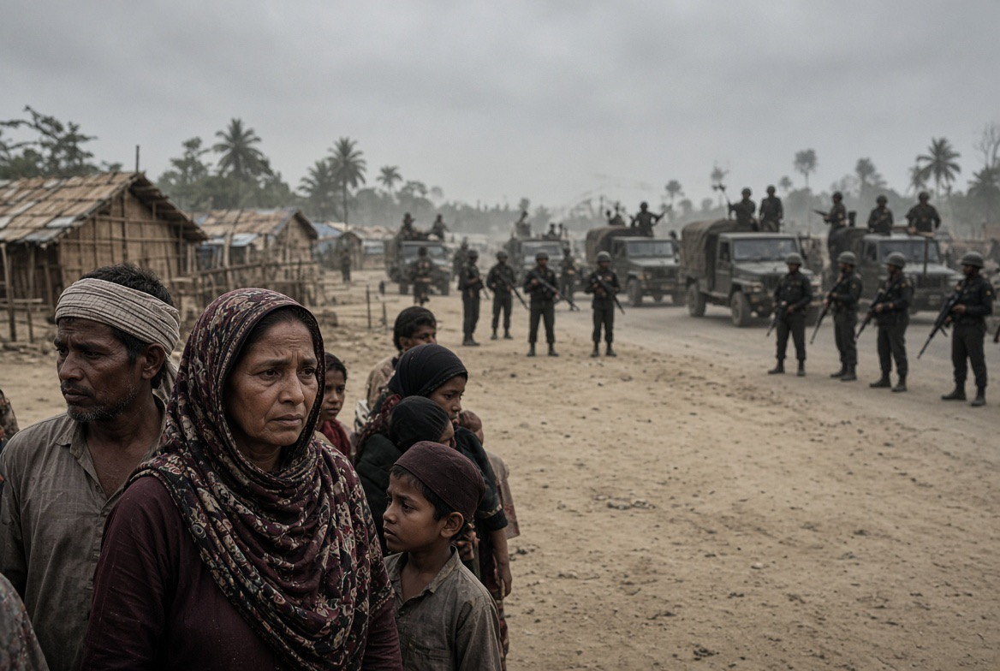

# Rohingya: Sembilan Tahun Eksodus, Mengapa Masih Tidak Punya Jalan Pulang?

*Ilustrasi (pic: Grok AI).*

  
***Sembilan tahun kemudian mereka masih meminta sesuatu yang seharusnya tidak perlu mereka perjuangkan sejak awal, yaitu hak untuk pulang dengan selamat***
  

Ada sesuatu yang sangat pahit dalam kasus Rohingya, mereka pernah diusir secara massal dari tanah kelahirannya, tetapi pengusiran itu ternyata tidak menyelesaikan persoalan.

Karena sembilan tahun kemudian, pertanyaannya bukan lagi sekadar “Mengapa mereka kabur?” melainkan “Mengapa kondisi yang membuat mereka kabur belum juga dihilangkan?”

## PBB Menyebut Situasi Memburuk

Laporan OHCHR yang dirilis 25 Agustus 2026 menyatakan bahwa sembilan tahun setelah operasi militer Myanmar yang menyebabkan eksodus besar Rohingya, mereka masih menghadapi atrocity crimes, perpindahan paksa massal, dan kondisi kemanusiaan yang sangat buruk. 

Laporan PBB terbaru mengenai Myanmar bahkan menyatakan kondisi HAM negara tersebut telah jatuh ke titik terendah baru, dengan pelanggaran berat dilakukan oleh militer Myanmar maupun Arakan Army, terutama terhadap komunitas Rohingya. 

Pelanggaran yang dilaporkan mencakup pembunuhan, penyiksaan, kerja paksa, penahanan sewenang-wenang, dan pemindahan paksa. 

Jadi benarkah Komisioner HAM PBB menggambarkan penderitaan mereka sebagai sangat memilukan?  Ya, substansi beritanya benar. Bahkan gambaran PBB lebih luas daripada sekadar satu kalimat dramatis.

## Rohingya Terjepit dari Dua Arah

Ini bagian yang sering hilang dari pemberitaan. 

Dulu fokus dunia terutama pada militer Myanmar, sekarang situasinya lebih rumit, Rohingya di Rakhine berada di tengah konflik antara militer Myanmar (junta) dan Arakan Army (AA).

PBB mengatakan kedua aktor tersebut melakukan pelanggaran terhadap penduduk sipil, sementara Rohingya menjadi salah satu kelompok yang sangat terdampak. 

Jadi tragedinya bukan “Rohingya hanya punya satu musuh.” Melainkan mereka menjadi populasi sipil yang terjebak dalam perebutan wilayah oleh aktor-aktor bersenjata.

Dan itu adalah salah satu posisi paling berbahaya dalam perang sipil.

## Pulang Bukan Sekadar Membuka Perbatasan

Bayangkan seseorang berkata: “Silakan pulang ke rumah.” Tetapi rumahnya tidak aman, hak kewarganegaraannya bermasalah, wilayahnya dikuasai aktor bersenjata, akses kemanusiaan terbatas, dan konflik masih berlangsung.

Maka pertanyaan ilmiahnya adalah “Pulang ke mana?”

UNRIC memperkirakan lebih dari 1,3 juta Rohingya telah melarikan diri dari Myanmar dalam berbagai gelombang, dengan sekitar 742.000 orang melarikan diri setelah operasi militer 2017. Bangladesh sekarang menampung sekitar 1,2 juta Rohingya. 

Dan pada 25 Agustus 2026, puluhan ribu Rohingya di Cox’s Bazar kembali menyerukan satu hal, mereka ingin pulang, tetapi pulang dengan aman. Bukan sekadar dikembalikan ke wilayah yang masih berbahaya. 

## Konsep Forced Return Sangat Penting

Dalam hukum pengungsi terdapat prinsip non-refoulement.

Secara sederhana, seseorang tidak boleh dikembalikan ke tempat di mana ia menghadapi risiko serius terhadap kehidupan atau kebebasannya.

Karena itu, “repatriasi” yang benar bukan Myanmar menerima, Bangladesh mengirim, lalu selesai.

Repatriasi yang layak harus memenuhi unsur aman, sukarela, bermartabat, dan berkelanjutan.

Kalau tidak? Itu bukan solusi. Itu hanya memindahkan tubuh pengungsi kembali ke lokasi bahaya.

## Persoalan Identitas Sangat Fundamental

Pemerintah Myanmar selama bertahun-tahun menolak mengakui Rohingya sebagai kelompok etnis yang memiliki hak kewarganegaraan penuh.

Ini menghasilkan sesuatu yang sangat berbahaya yaitu statelessness.

Bayangkan seseorang lahir di suatu wilayah. Keluarganya hidup di sana selama beberapa generasi, tetapi negara berkata: “Kamu bukan bagian dari kami.”

Lalu ketika kelompok tersebut terusir timbul pertanyaan “Kenapa mereka tidak pulang?” Lho… pulang sebagai siapa?

Ini bukan sekadar masalah migrasi. Ini masalah political membership.

Siapa yang dianggap sebagai manusia politik yang berhak memiliki negara?

## Tragedi Rohingya Tidak Berhenti pada 2017

2017 menghasilkan mass displacement.

Tetapi displacement tanpa penyelesaian politik menghasilkan refugee dependency, generational displacement, statelessness, kemiskinan, kerentanan terhadap eksploitasi, serta ketergantungan bantuan.

Sembilan tahun kemudian, anak yang lahir di kamp pengungsi dapat tumbuh tanpa pernah mengenal tanah yang secara historis dianggap sebagai rumah keluarganya.

Itulah bagaimana sebuah konflik berubah menjadi warisan antargenerasi.

## Ironi Lain yang Sangat Menyakitkan

Dunia mengenang 2017 sebagai tragedi Rohingya, tetapi 2026 menunjukkan bahwa akar masalahnya belum hilang.

PBB sekarang mengatakan situasi HAM Myanmar secara keseluruhan bahkan semakin buruk. 

Jadi problemnya bukan Myanmar pernah melakukan kekerasan. Problemnya adalah mekanisme politik yang menghasilkan kekerasan tersebut belum berhasil dihentikan.

Dan selama mekanismenya tetap hidup, korban dapat berganti. Hari ini Rohingya, besok komunitas etnis lain, atau warga sipil yang dianggap berada di pihak yang salah.

## Kesalahan Analitis: Semua Penderitaan Myanmar Bukan Hanya Soal Rohingya

Ini penting.

Myanmar sekarang mengalami perang sipil yang jauh lebih luas sejak kudeta militer 2021.

OHCHR melaporkan lebih dari 8.000 warga sipil tewas dalam periode yang dikaji, sementara sekitar 3,6 juta orang mengalami displacement internal dan jutaan lainnya menghadapi kerawanan pangan. 

Jadi Rohingya adalah salah satu kelompok paling rentan dalam krisis yang lebih besar.

Namun ada perbedaan historis penting, Rohingya telah mengalami persekusi berbasis identitas selama puluhan tahun, sehingga kerentanan mereka bukan hanya akibat perang sipil saat ini.

Itulah mengapa kasus Rohingya tidak boleh direduksi menjadi korban perang saudara Myanmar. Mereka mempunyai sejarah diskriminasi, statelessness, dan kekerasan berbasis identitas yang jauh lebih panjang.

Kita sering mengatakan dunia harus membantu pengungsi Rohingya. Hal itu benar, tetapi itu hanya menyelesaikan gejala.

Kalau 1,2 juta orang terus tinggal di kamp pengungsian, dunia sebenarnya sedang mengelola konsekuensi dari kegagalan politik.

Bantuan kemanusiaan adalah perban, tetapi penyakitnya adalah impunitas, statelessness, konflik bersenjata, diskriminasi, perebutan wilayah, serta kegagalan perlindungan internasional. Dan perban tidak menyembuhkan penyakit sistemik.

## Mengapa Dunia Begitu Sulit Menyelesaikannya?

Karena solusi yang benar membutuhkan sesuatu yang jauh lebih mahal daripada bantuan makanan, yakni political settlement.

Harus ada perlindungan sipil, akses kemanusiaan, akuntabilitas, penyelesaian status kewarganegaraan, keamanan Rakhine, mekanisme repatriasi, dan jaminan bahwa mereka tidak kembali menjadi korban kekerasan.

Semua itu membutuhkan kekuatan politik internasional. Dan di situlah mesin diplomasi dunia sering berubah menjadi kura-kura memakai jas. 

Semua negara: “Kami sangat prihatin.”
Rohingya: “Terus?”
Dunia: “Kami akan mengeluarkan pernyataan.”
Rohingya: “Terus?”
Dunia: “Kami akan mengadakan konferensi.”
Rohingya: “TERUS?”
Dan sembilan tahun berlalu.

Yang sedang terjadi bukan sekadar “Rohingya masih menderita”. Ini adalah contoh klasik bagaimana persekusi, pengusiran, pengungsian, statelessness, konflik baru, serta pengungsian baru dapat membentuk lingkaran displacement yang berlangsung lintas generasi.

Dan kalimat paling tragisnya mungkin justru ini, Rohingya tidak hanya kehilangan rumah; mereka kehilangan kepastian bahwa dunia akan mengakui hak mereka untuk kembali ke rumah itu.

Pada 25 Agustus 2026, tepat sembilan tahun setelah eksodus besar 2017, puluhan ribu Rohingya kembali turun bersuara di kamp-kamp Bangladesh dan menuntut kepulangan yang aman. 

Itulah ironi terbesar, sembilan tahun kemudian mereka masih meminta sesuatu yang seharusnya tidak perlu mereka perjuangkan sejak awal, yaitu hak untuk pulang dengan selamat.

  
**Referensi**

Office of the United Nations High Commissioner for Human Rights. (2026, August 25). Nine years on: Rohingya continue to face atrocity crimes, mass displacement and severe humanitarian conditions. OHCHR⁠

Office of the United Nations High Commissioner for Human Rights. (2026, August 25). Human rights situation in Myanmar plummets to a new low amid unrelenting violations and unregulated exploitation of natural resources. OHCHR⁠

Associated Press. (2026, August 25). Rohingya refugees rally in Bangladesh camps to demand safe return to Myanmar. AP News⁠

United Nations Regional Information Centre. (2026, August 19). Myanmar: The Rohingya crisis. UNRIC⁠
