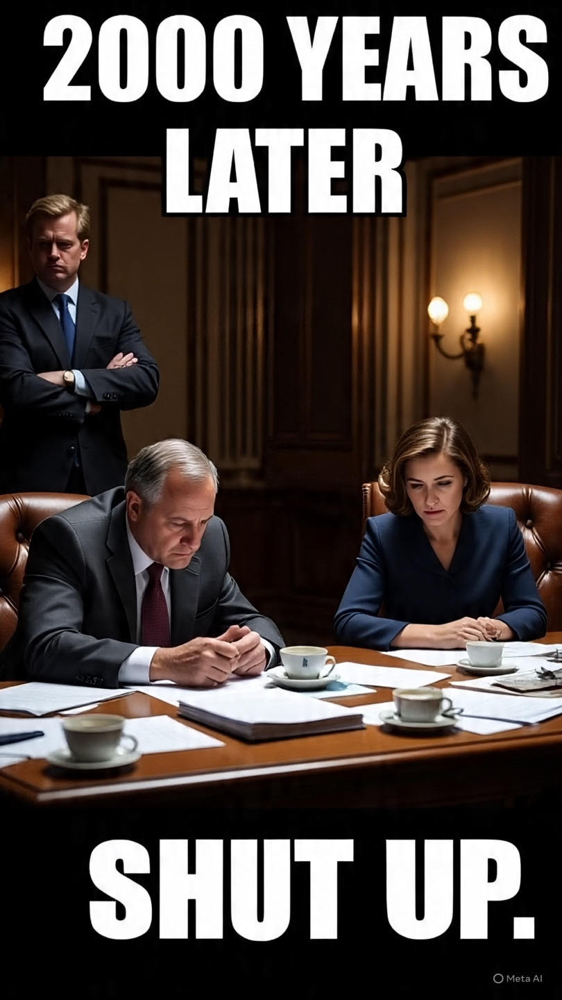

# “2000 Years Later”: Meme Warfare, AI Satire & Runtuhnya Wibawa Diplomasi Modern Konflik Iran–AS 2026

*Ilustrasi meme parodi (pic: Meta AI).*

  
***Analisis Propaganda Digital, Psychological Operations, dan Politik Humor di Era AI***
  

Artikel ini menganalisis fenomena viral video parodi AI tentang perundingan Iran–AS pada April 2026, dimana delegasi Iran digambarkan tidak pernah datang ke meja negosiasi, lalu hanya mengirim pesan singkat kepada Presiden Donald Trump: “Trump, shut up.” 

Video tersebut menjadi simbol transformasi konflik geopolitik modern dari perang konvensional menuju meme warfare dan propaganda berbasis AI. 

Tulisan ini menunjukkan bahwa humor digital kini bukan sekadar hiburan, melainkan instrumen psikologis untuk merusak legitimasi lawan, membentuk persepsi publik global, dan menertawakan simbol kekuasaan.

## Pendahuluan

Dulu negara adidaya menakutkan lewat:

kapal induk

rudal balistik

pidato presiden

Sekarang?

👉 kadang cukup dengan video AI absurd berdurasi 40 detik dan caption sarkastik.

Pada 22 April 2026, video parodi AI yang beredar luas memperlihatkan delegasi AS menunggu Iran di meja perundingan. 

Trump versi AI berkali-kali mengancam pemboman jika Iran tidak datang. Setelah tulisan “2000 years later”, Iran hanya mengirim pesan:

“Trump, shut up.”  

Dan internet… meledak tertawa.

Jika dahulu kekaisaran jatuh oleh wabah dan perang. Sekarang reputasi geopolitik bisa digerogoti oleh editan AI dengan timing komedi yang tepat.

AI Satire sebagai Senjata Politik

1. Dari propaganda klasik ke meme warfare

Propaganda tradisional bersifat:

formal

nasionalistik

serius

Sedangkan propaganda AI modern:

lucu

absurd

sangat mudah viral

Iran dan jaringan media pro-Iran diketahui aktif menggunakan video AI satir selama perang 2026.  

2. Humor sebagai delegitimasi

Tujuan video itu bukan membuktikan fakta.

Tujuannya:

👉 membuat lawan terlihat:

lemah

putus asa

tidak dihormati

Dalam teori komunikasi politik, ini disebut:

symbolic degradation

Trump dalam video tidak dikalahkan oleh misil.

Ia dikalahkan oleh… di-ignore.

Dan secara psikologis, itu tamparan keras.

## “2000 Years Later”: Simbol Peradaban Persia

Tulisan “2000 years later” bukan sekadar lelucon.

Itu membawa pesan implisit:

“Kami bangsa tua. Kami tidak tunduk pada ultimatum cepat.”

Iran sering membingkai dirinya sebagai:

pewaris Persia kuno

peradaban panjang

negara yang bertahan melewati imperium besar

Jadi ketika Trump digambarkan menunggu marah-marah…

Iran ingin terlihat:

👉 tenang

👉 sabar

👉 tidak terintimidasi

## Diplomasi sebagai Pertunjukan Internet

1. Negosiasi berubah jadi konten

Di era digital:

perang terjadi di medan tempur
tapi legitimasi terjadi di media sosial

Video AI viral dapat:

membentuk persepsi publik lebih cepat dari konferensi pers resmi

menjangkau jutaan orang lintas negara

mempengaruhi citra pemimpin global

2. Bahaya normalisasi konflik sebagai hiburan

Namun ada sisi gelapnya.

Saat perang berubah jadi meme:

👉 publik bisa lupa bahwa:

orang sungguhan sedang mati

kota sungguhan sedang dibom

Fenomena ini disebut:

gamification of conflict

Perang menjadi tontonan algoritmik.

## AI, Disinformasi, dan Krisis Kebenaran

Video seperti ini juga memperlihatkan:

batas antara satire dan propaganda makin kabur

AI mempermudah manipulasi visual

emosi publik lebih mudah diarahkan

Laporan tentang disinformasi selama perang Iran 2026 menunjukkan ledakan konten AI palsu di media sosial.  

## Analisis Politik yang Lebih Dalam

🔥 Iran menang perang meme?

Tidak sepenuhnya.

Tapi Iran berhasil:

mengolok simbol kekuasaan AS

memanfaatkan budaya internet global

mengubah dirinya dari “target” menjadi “aktor yang mengejek balik”

Dan itu penting.

Karena dalam geopolitik modern:

persepsi publik adalah bagian dari medan perang.

Video AI “Trump, shut up” menunjukkan transformasi konflik internasional di era kecerdasan buatan. 

Humor, meme, dan satire kini menjadi instrumen strategis untuk melemahkan wibawa lawan dan membentuk opini global. 

Dalam kondisi ini, perang tidak lagi hanya berlangsung melalui misil dan embargo, tetapi juga melalui algoritma, viralitas, dan absurditas internet.

  
**Referensi**

Moneycontrol. (2026). How was ceasefire with US extended? Iran posts viral clip with an AI twist.  

European Broadcasting Union. (2026). ‘Slopaganda’: How Iran is using memes to troll Trump.  

Wikipedia contributors. (2026). Explosive Media.  

Wikipedia contributors. (2026). Misinformation during the 2026 Iran war.  

Rossetti, M., & Zaman, T. (2022). Bots, Disinformation, and the First Trump Impeachment. arXiv.  
