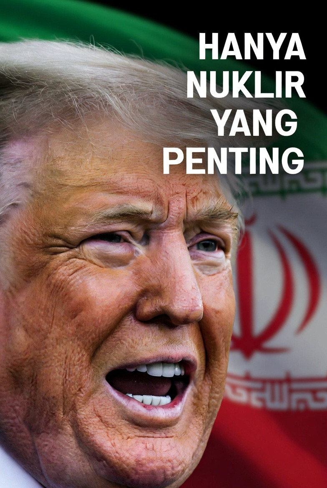

# “Hanya Nuklir yang Penting”? Trump, Iran, dan Geopolitik Ketakutan Nuklir Timur Tengah 

*Ilustrasi Presiden AS Donald Trump (pic: Grok AI).*

  
***Sebenarnya bukan soal nuklir. Tapi soal siapa yang berhak merasa aman & siapa yang dipaksa tetap lemah. Dan itu… inti paling telanjang dari geopolitik modern***
  

Pernyataan Donald Trump bahwa “satu-satunya isu penting adalah nuklir Iran” memperlihatkan bagaimana program nuklir Iran tetap menjadi pusat gravitasi geopolitik Timur Tengah. 

Meski Amerika Serikat mengklaim posisinya didasarkan pada keamanan global, banyak analis melihat bahwa kekhawatiran utama sebenarnya berkaitan dengan keseimbangan kekuatan regional dan keamanan Israel. 

Tulisan ini membahas hubungan antara strategi AS, kecemasan eksistensial Israel, dan hak Iran atas teknologi nuklir damai dalam kerangka hukum internasional.

## Kenapa Nuklir Iran Selalu Membuat Dunia Panas?

Karena nuklir bukan cuma teknologi. Ia adalah:
simbol kekuatan,
alat deterrence,
tiket masuk klub negara “tak bisa disentuh.”

Begitu sebuah negara punya kapasitas nuklir, bahkan jika belum membuat bom, cara dunia memperlakukannya langsung berubah.

## Apakah Israel Aktor Paling Cemas?

Dalam praktik geopolitik, Israel memang salah satu pihak yang paling gelisah.

Kenapa?

Karena Iran adalah:
rival regional utama,
pendukung kelompok anti-Israel,
negara dengan retorika konfrontatif terhadap Israel selama puluhan tahun.

Dari perspektif Israel: nuklir Iran = ancaman eksistensial.

## AS Benar-Benar Peduli “Dunia”… atau Israel?

Nah, ini bagian paling menarik.

Secara resmi, AS berkata: “nuklir Iran akan membahayakan dunia.” Tapi dalam analisis hubungan internasional, yang dimaksud “dunia” sering kali berarti:
stabilitas sekutu AS,
sistem aliansi Barat,
dan terutama keamanan Israel + Teluk.

Karena ancaman Iran terhadap Peru atau Norwegia misalnya… praktis minim, tapi terhadap Israel? Sangat relevan secara strategis.

## Apakah Iran Boleh Memiliki Nuklir Damai?

Ini poin yang sering dipelintir publik.

Menurut International Atomic Energy Agency dan perjanjian Treaty on the Non-Proliferation of Nuclear Weapons, Iran sebenarnya berhak:
mengembangkan energi nuklir damai,
riset nuklir sipil,
pengayaan uranium tingkat rendah.

SELAMA:
diawasi,
tidak menuju senjata nuklir.

## Mengapa Trump Mengatakan “Tidak Boleh Sedikitpun”?

Karena masalah utamanya bukan sekadar “reaktor damai”. Masalahnya adalah teknologi nuklir sipil dan militer hanya dipisahkan oleh tingkat pengayaan & kapasitas teknis.

Artinya:
negara yang bisa mengayakan uranium untuk energi,
secara teoritis juga bisa bergerak menuju bom.

Ini disebut,“nuclear latency”, yakni kemampuan menjadi negara nuklir kapan saja. Dan Israel sangat takut pada fase ini.

## Standar Ganda?

Nah… ini bagian yang bikin banyak negara Global South sinis. Karena:
Israel sendiri diyakini memiliki senjata nuklir,
tapi tidak menandatangani NPT,
sementara Iran yang anggota NPT ditekan habis-habisan.

Maka muncul tuduhan: “aturan nuklir global tidak benar-benar netral.”

## Kenapa AS Terkesan “Maksa”?

Karena bagi Washington, nuklir Iran berpotensi:
memicu perlombaan senjata Timur Tengah,
membuat Saudi, Turki, dll ikut mengejar nuklir,
mengurangi dominasi strategis AS.

Jadi ini bukan cuma soal satu bom. Ini soal siapa yang mengontrol keseimbangan kekuatan regional.

Pernyataan Trump bahwa “hanya nuklir yang penting” menunjukkan bahwa ekonomi domestik AS bisa naik-turun, dan konflik regional bisa datang-pergi. Tetapi potensi Iran menjadi “threshold nuclear state” dianggap ancaman strategis jangka panjang.

Sebenarnya bukan soal nuklir. Tapi soal siapa yang berhak merasa aman… dan siapa yang dipaksa tetap lemah. Dan itu… inti paling telanjang dari geopolitik modern 

Ketika AS berkata “demi keamanan dunia” yang sering dimaksud sebenarnya adalah keamanan tatanan geopolitik yang menguntungkan sekutu-sekutunya.

Dan di Timur Tengah…
sekutu paling sensitif itu memang Israel.

  
**Referensi**

International Atomic Energy Agency. (2026). Iran nuclear monitoring reports.

Treaty on the Non-Proliferation of Nuclear Weapons. (1968). Treaty text and safeguards framework.

Reuters. (2026, May 17). Trump says only issue that matters is Iran’s nuclear program.

Waltz, K. N. (2012). Why Iran should get the bomb. Foreign Affairs, 91(4), 2–5.
