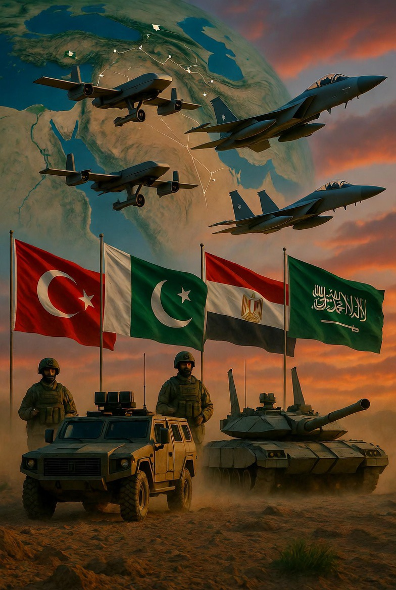

# “Israel Raya” dalam Imajinasi Politik Timur Tengah: Antara Mitos Geopolitik, Nasionalisme Religius, dan Ketakutan Regional

*Ilustrasi aliansi (pic: Grok AI).*

  
***Kadang negara membangun aliansi bukan karena perang sudah terjadi tetapi karena mereka takut suatu hari nanti, api itu akan sampai ke halaman rumah mereka sendiri***
  

Konsep “Israel Raya” atau Greater Israel sering muncul dalam diskursus politik Timur Tengah, terutama saat konflik Israel–Palestina memanas. 

Sebagian pihak melihatnya sebagai proyek ekspansionis nyata, sementara pihak lain menganggapnya lebih sebagai simbol ideologis kelompok ultra-nasionalis religius tertentu. 

Tulisan ini menganalisis asal-usul konsep tersebut, sejauh mana ia memengaruhi geopolitik regional, serta mengapa negara-negara seperti Turki, Pakistan, Mesir, dan Saudi Arabia semakin sensitif terhadap kemungkinan ekspansi pengaruh Israel di kawasan.

## Pendahuluan

 “Israel Raya” adalah salah satu istilah paling eksplosif di Timur Tengah.

Bagi sebagian kalangan Arab dan Muslim, istilah ini memunculkan bayangan:
ekspansi tanpa batas,
dominasi regional,
penghancuran Palestina,
bahkan ancaman terhadap negara-negara sekitar.

Sementara bagi sebagian pendukung Zionisme religius ekstrem:

konsep itu dipandang sebagai janji historis atau teologis.

Masalahnya, antara:
simbol religius,
slogan politik,
dan kebijakan negara nyata,
sering bercampur sampai sulit dibedakan.

## Apa Itu “Israel Raya”?

Konsep ini berasal dari interpretasi tertentu terhadap:
teks religius Yahudi,
narasi historis kuno tentang Tanah Perjanjian.

Dalam bentuk paling ekstrem, peta “Greater Israel” kadang digambarkan mencakup:
Palestina historis,
sebagian Lebanon,
sebagian Suriah,
sebagian Yordania.

Tapi penting:

tidak ada kebijakan resmi negara Israel modern yang secara formal menyatakan akan menaklukkan seluruh Timur Tengah atau seluruh negara Teluk.

Jadi klaim:

“Israel akan menguasai seluruh Timur Tengah”

secara faktual belum punya dasar kebijakan resmi negara.

## Kenapa Ketakutan Itu Tetap Hidup?

Karena geopolitik tidak hanya dibangun oleh fakta…
tetapi juga oleh:
persepsi,
trauma sejarah,
dan simbol kekuasaan.

Banyak negara Muslim melihat:
pendudukan Palestina,
pembangunan permukiman,
aneksasi bertahap,
operasi militer lintas negara,
serangan ke Lebanon, Suriah, Iran,
sebagai pola ekspansi kekuatan Israel.

Akibatnya muncul ketakutan:

“kalau Palestina saja terus menyusut… siapa berikutnya?”.

## Apakah Ada Aliansi Negara Muslim untuk Menghadapi Israel?

Ini bagian yang sering dibesar-besarkan media dan propaganda.

Realitanya:

Memang ada:
kerja sama keamanan,
koordinasi diplomatik,
dan pembicaraan strategis,
antara:
Turki,
Pakistan,
Saudi Arabia,
Mesir,
Iran (dalam jalur berbeda),
terkait stabilitas regional.

Namun:

belum ada “aliansi militer resmi anti-Israel” seperti NATO versi Muslim.

Yang ada lebih berupa:
balancing strategy,
deterrence posture,
dan persiapan menghadapi kemungkinan eskalasi regional.

## Kenapa Saudi dan Negara Teluk Mulai Waspada?

Karena Israel sekarang bukan lagi hanya isu Palestina.

Israel telah menjadi:
kekuatan militer regional besar,
aktor intelijen sangat kuat,
partner strategis AS,
pemain teknologi dan keamanan utama.

Ditambah lagi:
perang Iran,
operasi lintas batas,
dan normalisasi Abraham Accords,
mengubah keseimbangan Timur Tengah.

Negara-negara Teluk mulai berpikir:

“bagaimana kalau suatu hari kepentingan kami juga berbenturan?”.

## Kenapa Pakistan Sensitif?

Pakistan memiliki:
solidaritas historis terhadap Palestina,
identitas politik Islam kuat,
dan status sebagai negara nuklir Muslim.
Di sebagian narasi populer dunia Muslim:
Pakistan dipandang sebagai “penyeimbang terakhir” jika konflik regional membesar.

Walaupun secara praktik:
Pakistan juga berhati-hati karena:
tekanan ekonomi,
hubungan dengan AS,
dan risiko perang besar.

## Masalah Utama: Ideologi Ultra-Nasionalis

Yang membuat dunia khawatir sebenarnya bukan seluruh warga Israel.

Melainkan:

munculnya kelompok ultra-kanan religius dan nasionalis ekstrem.

Beberapa tokoh ekstrem memang:
memakai retorika ekspansionis
berbicara tentang dominasi penuh
atau mendukung aneksasi luas Palestina.

Dan ketika tokoh seperti itu masuk pemerintahan… dunia mulai bertanya:

“apakah ide marginal mulai berubah jadi kebijakan negara?”.

## Perspektif Israel

Dari sisi Israel sendiri, banyak warga Israel merasa:
mereka terus dikelilingi ancaman,
menghadapi kelompok bersenjata,
dan hidup dalam ketakutan eksistensial sejak berdirinya negara.
Akibatnya:
kebijakan agresif sering dibenarkan sebagai pertahanan hidup nasional.

Masalahnya, bagi dunia Arab “pertahanan” Israel sering terlihat seperti:

ekspansi bertahap dengan legitimasi keamanan.

Dan di situlah dua narasi besar terus bertabrakan.

## Inti Terdalamnya

“Israel Raya” sebenarnya bukan cuma soal peta.

Ia adalah:

simbol ketakutan geopolitik Timur Tengah.

Bagi banyak masyarakat Muslim:
itu melambangkan:
hilangnya Palestina,
dominasi Barat,
dan ekspansi kekuatan bersenjata.

Sementara bagi sebagian nasionalis religius Yahudi, itu melambangkan:
sejarah,
identitas,
dan klaim spiritual.

Ketika dua imajinasi sejarah bertabrakan…
lahirlah konflik yang bukan hanya soal tanah,
tetapi soal:

siapa yang merasa dijanjikan masa depan oleh Tuhan dan sejarah.

Sampai saat ini tidak ada bukti resmi bahwa Israel berencana menaklukkan seluruh Timur Tengah atau negara Teluk.

Namun:
kebijakan militer agresif,
ekspansi permukiman,
dan retorika ultra-kanan,
membuat ketakutan regional tetap hidup.

Dan, di Timur Tengah kadang ketakutan geopolitik tidak lahir dari apa yang sudah dilakukan, tetapi dari apa yang orang takut mungkin akan dilakukan berikutnya.

  
**Referensi**

Shlaim, A. (2001). The iron wall: Israel and the Arab world. W.W. Norton.

Finkelstein, N. (2003). Image and reality of the Israel-Palestine conflict. Verso.

Morris, B. (2008). 1948: A history of the first Arab-Israeli war. Yale University Press.

United Nations Charter (1945).
