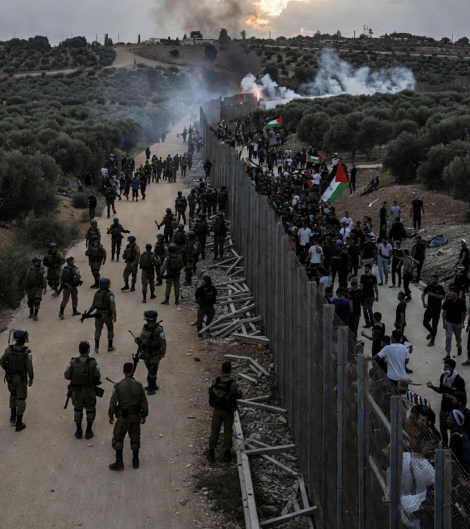

# “Lukaku Nyata, Tapi Lukamu Juga Nyata”: Mengapa Prinsip Memahami Akar Konflik Sulit Diterapkan dalam Konflik Israel-Palestina?

*Ilustrasi (pic: Grok AI).*

  
***Manusia yang terluka sering kali lebih pandai mengingat rasa sakitnya sendiri daripada memahami rasa sakit orang lain***
  

Dalam diskusi tentang konflik Israel-Palestina sering muncul dua pernyataan: “Kita harus memahami akar radikalisme Palestina.” tetapi juga: “Kekerasan terhadap warga sipil Israel tidak dapat dibenarkan.”

Lalu muncul pertanyaan yang menusuk: Kalau begitu, mengapa Israel tidak menerapkan prinsip yang sama? Mengapa trauma dan ketakutan Israel sering dipahami sebagai konteks, tetapi penderitaan Palestina sering dipandang sebagai ancaman?

Tulisan ini berargumen bahwa konflik Israel-Palestina bukan sekadar pertarungan wilayah, melainkan benturan antara dua narasi korban, dua memori sejarah, dan dua ketakutan eksistensial yang terus saling memperkuat.

## Prinsip yang Sering Disalahpahami

Mari kita mulai dari kalimat ini, memahami penyebab kekerasan tidak sama dengann membenarkan kekerasan. Kalimat ini berlaku universal.

Kalau seorang akademisi menjelaskan blokade Gaza, pendudukan, pengungsian, atau sengketa tanah, sebagai faktor yang memicu radikalisasi, itu bukan berarti ia membenarkan pembunuhan warga sipil.

Demikian juga, kalau seseorang menjelaskan trauma Holocaust, perang 1948, ancaman keamanan, serta serangan roket, sebagai alasan mengapa masyarakat Israel sangat obsesif terhadap keamanan, itu bukan berarti semua tindakan militer Israel otomatis benar.

Dalam ilmu sosial, penjelasan (explanation) berbeda dari pembenaran (justification).

## Israel Membawa Trauma yang Sangat Dalam

Banyak orang lupa, Israel lahir tidak lama setelah The Holocaust, ketika sekitar enam juta orang Yahudi dibunuh Nazi. Trauma itu membentuk psikologi nasional Israel.

Banyak warga Israel tumbuh dengan keyakinan: “Kalau kami tidak kuat, kami bisa dimusnahkan lagi.” Akibatnya, keamanan bukan sekadar kebijakan. Keamanan menjadi identitas nasional.

Itulah sebabnya banyak warga Israel mendukung operasi militer yang bagi dunia luar terlihat sangat keras.

Mereka takut, dan rasa takut bisa mengubah cara manusia menilai benar dan salah.

## Palestina Membawa Trauma yang Tidak Kalah Besar

Di sisi lain, warga Palestina memiliki memori kolektif tentang 1948 atau yang oleh banyak warga Palestina disebut Nakba (“malapetaka”).

Ratusan ribu warga Palestina kehilangan rumah dan mengungsi selama perang 1948. Lalu perang 1967, pendudukan Tepi Barat, blokade Gaza, sengketa Yerusalem Timur, serta perluasan permukiman.

Bagi banyak warga Palestina, mereka tidak sedang kehilangan perang. Mereka merasa sedang kehilangan tanah, rumah, dan masa depan.

Trauma ini diwariskan. Anak mewarisi cerita ayah, ayah mewarisi cerita kakek, luka berubah menjadi identitas.

## Ketika Dua Korban Bertemu

Nah, di sini konfliknya menjadi sangat rumit.
Karena Israel berkata: “Kami takut dimusnahkan.” Palestina berkata: “Kami takut dihapuskan.” Israel berkata: “Kami korban sejarah.” Palestina berkata: “Kami juga korban sejarah.”

Akibatnya, kedua pihak masuk ke kondisi yang dalam psikologi politik disebut: Competitive Victimhood atau persaingan menjadi korban.

Masing-masing merasa penderitaannya paling besar, traumanya paling nyata, ancamannya paling serius.

Akibatnya: empati menjadi barang langka.

## Mengapa Prinsip Universal Sulit Diterapkan?

Karena manusia tidak selalu rasional. Ada fenomena psikologis Moral Exceptionalism, yaitu aturan moral yang berlaku untuk orang lain dianggap tidak selalu berlaku untuk kelompok sendiri.

Contohnya, jika lawan membunuh warga sipil disebut terorisme. Tetapi jika kelompok sendiri menyebabkan korban sipil, dianggap pembelaan diri, kerusakan sampingan, dan hanya konsekuensi perang.

Padahal menurut International Committee of the Red Cross, hukum humaniter internasional berlaku untuk semua pihak. Tidak peduli negara, kelompok bersenjata, pihak kuat, ataupun pihak lemah.

Pernah tidak kita berpikir, kalau konflik Israel-Palestina itu seperti dua orang yang sama-sama terluka, berdiri saling berhadapan, masing-masing berteriak: “Lihat lukaku!”

Tetapi tidak ada yang benar-benar mampu berkata: “Aku melihat lukamu juga.”

Padahal, luka yang tidak diakui, sering berubah menjadi dendam, radikalisme, atau kekerasan baru.

Dan luka yang dibalas dengan luka, jarang menghasilkan penyembuhan. Ia hanya menghasilkan generasi baru yang tumbuh dengan kemarahan lama.

## Mengapa Israel Tidak Selalu Menerapkan Prinsip Itu?

Jawaban ilmiahnya: Bukan karena seluruh Israel menolak prinsip tersebut, melainkan karena:
Trauma Holocaust membentuk budaya keamanan yang sangat kuat.
Konflik panjang membuat rasa takut mengalahkan empati.
Politik domestik sering memperkuat narasi “kami versus mereka”.
Kedua pihak mengalami competitive victimhood, sehingga lebih mudah melihat penderitaan sendiri daripada penderitaan lawan.

Pertanyaan: “Mengapa Israel tidak menerapkan prinsip memahami akar masalah tanpa membenarkan kekerasan? tidak memiliki jawaban sederhana.

Tetapi ilmu sejarah, psikologi politik, dan hubungan internasional memberi petunjuk: Karena manusia yang terluka sering kali lebih pandai mengingat rasa sakitnya sendiri daripada memahami rasa sakit orang lain.

Dan mungkin, itulah tragedi terbesar konflik ini.

Bukan karena tidak ada yang tahu bahwa warga sipil harus dilindungi. Tetapi karena: semua pihak menganggap dirinya korban, sementara sangat sedikit yang sanggup berkata: “Lukaku nyata. Tetapi lukamu juga nyata.”

  
**Referensi**

Raul Hilberg. (2003). The Destruction of the European Jews (3rd ed.). Yale University Press.

Timothy Snyder. (2010). Bloodlands: Europe Between Hitler and Stalin. Basic Books.

Benny Morris. (2004). The Birth of the Palestinian Refugee Problem Revisited. Cambridge University Press.

Ilan Pappé. (2006). The Ethnic Cleansing of Palestine. Oneworld Publications.

ICRC. (1949). Geneva Conventions of 1949.

ICRC. (2024). International Humanitarian Law and the Challenges of Contemporary Armed Conflicts.  

Daniel Bar-Tal, Lily Chernyak-Hai, Noa Schori, & Ayelet Gundar. (2009). A Sense of Self-Perceived Collective Victimhood in Intractable Conflicts. International Review of the Red Cross, 91(874), 229-258. DOI: 10.1017/S1816383109990221.  

Daniel Bar-Tal, Neta Oren, & Rafi Nets-Zehngut. (2014). Sociopsychological Analysis of Conflict-Supporting Narratives: A General Framework. Journal of Peace Research, 51(5), 662-675.  

Daniel Sullivan, Mark J. Landau, Nyla R. Branscombe, & Zachary K. Rothschild. (2012). Competitive Victimhood as a Response to Accusations of Ingroup Harm Doing. Journal of Personality and Social Psychology, 102(4), 778-795.  
